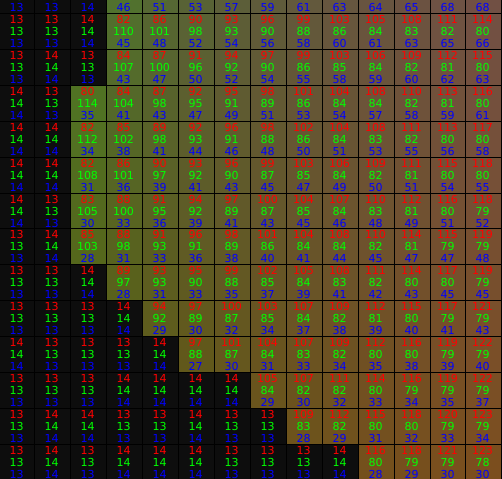

# Toolkit for the CHOC dataset

Toolkit accompanying the CORSMAL Hand-Occluded Containers (CHOC) dataset for 
1. inspecting the depth and NOCS data in 3D, 
2. refine the background of the generated NOCS maps in the mixed-reality set, 
3. converting the 6D object poses from the Blender environment to the camera-to-object coordinate system,
4. installing the GraspIt! tool and loading GraspIt! worlds containing the annotated synthetic MANO hand grasping the synthetic object.

[[dataset](https://zenodo.org/record/5085801#.Y3zGQ9LP2V4)]
[[webpage](https://corsmal.eecs.qmul.ac.uk/pose.html)]
[[arxiv pre-print](https://arxiv.org/abs/2211.10470)]

## Table of contents
1. [Installation](#requirements)
2. [Running sample codes](#running)
   1. [Inspect the data](#inspect)
   2. [Clean the NOCS backgrounds](#clean)
   3. [Convert poses](#convert)
3. [Load GraspIt! worlds](#instructions)
4. [Enquiries](#enquiries)
6. [License](#license)

## Installation <a name="requirements"></a>

The toolkit was implemented and tested with the following requirements on a machine with Ubuntu 18.04

Requirements:
- Anaconda 4.13.0
- Python 3.9
- SciPy 1.9.3
- Open3D 0.16.0
- NumPy 1.23.5
- OpenCV 4.5.5.64

Use the following commands to install the toolkit within an Anaconda environment:
```
conda create -n CHOC-toolkit-env python=3.9
conda activate CHOC-toolkit-env
pip install -r requirements.txt
```

## Running sample codes <a name="running"></a>

The toolkit takes as input and processes a single RGB-D image (and corresponding annotations) from a batch of the mixed-reality set to perform either of these three operations:
1. inspecting the data in 3D
2. cleaning the background of the annotated NOCS maps (Normalised Object Coordinate Space, see [Wang et al.'s work](https://geometry.stanford.edu/projects/NOCS_CVPR2019/))
3. converting the annotated 6D object poses in Blender environment into the 6D object poses from camera to object coordinate system.

The general command to run the toolkit is
```
python main.py --choc_dir <path_to_choc> --image_index <img_index> --operation <operation>
```

Arguments:
* *choc_dir*: local path to the CHOC dataset
* *image_index*: index of the image to process in 6-digit string format
* *operation*: operation to perfom on the image between *inspect*, *fix_nocs*, *convert_pose* (default: *inspect*)

As a demo, you can test the three operations on the index 000251, provided as example in the [_sample_](sample) folder.

<details>
<summary> Show images for 000251</summary>

<br>

  RGB                       |  NOCS                     |  Mask                     |  Depth
:--------------------------:|:-------------------------:|:-------------------------:|:-------------------------:
 |||

</details>

### Inspecting the data <a name="inspect"></a>

To visualise data in 3D, you can run from terminal the following command:
```
python main.py --choc_dir <path_to_choc> --image_index 000251 --operation inspect
```

<details>
<summary> Show result for 000251</summary>

<br>

Legend:
* green: un-normalised NOCS-points
* blue: depth points 
* red: un-normalised NOCS points transformed using the converted pose

  Object                      |  Depth, Annotation        |  Both                     
:----------------------------:|:-------------------------:|:-------------------------:
 ||

Note: all points are visualised in the camera coordinate system (OpenGL convention).

</details>


### Clean the NOCS backgrounds <a name="clean"></a>

We observed that the rendering process in Blender does not alwayse set to 0 all the background pixels for the ground-truth NOCS maps, and many pixels have triplet values like [13,13,13] or [14,14,14] (although this was not verified across all generated maps). The toolkit provides a sample code to set these background pixels to 0 by exploiting the [Otsu's method](https://docs.opencv.org/4.x/d7/d4d/tutorial_py_thresholding.html#:~:text=Otsu's%20Binarization,determines%20it%20automatically), available in OpenCV, to dynamically segmenting the foreground from background. Note that this algorithm is not always accurate and may remove some pixels of the foreground object (NOCS values).

To refine the background of the ground-truth NOCS maps, you can run from terminal the following command:
```
python main.py --choc_dir <path_to_choc> --image_index 000251 --operation fix_nocs
```
<details>
<summary> Show NOCS map for 000251 before and after applying Otsu's method</summary>

<br>


  Before                    |  After
:--------------------------:|:-------------------------:
 |

</details>

### Convert the poses <a name="convert"></a>

6D object poses are annotated based on how the object was placed in the Blender environment, which differs from the standard annotation of 6D object poses as camera-to-object coordinate system (or inverse). To convert the pose, you can run from terminal the following command:
```
python main.py --choc_dir <path_to_choc> --image_index <image_index_string> --operation convert_pose
```

We show the annotation file for the example "000251", where the pose is given by _location\_xyz_ and _pose\_quaternion\_wxyz_ (quaternion representation):
```
{
    "background_id": "000016.png",
    "flip_box": false,
    "grasp_id": 0,
    "location_xyz": [
        -0.1323072761297226,
        1.0679999589920044,
        -0.029042737558484077
    ],
    "object_id": 29,
    "pose_quaternion_wxyz": [
        0.9741891026496887,
        0.16082336008548737,
        0.15678565204143524,
        -0.022577593103051186
    ],
    "occlusion_ratio": 37.99846625766871
}
```
and, the conversion results in the following output (representation as a 4x4 transformation matrix instead of quaternions):
```
Pose for blender:
[[   0.94981703    0.09441928    0.29821572 -132.30727613]
 [   0.0064399     0.9472522    -0.3204244  1067.99995899]
 [  -0.31273974    0.30626503    0.89910822  -29.04273756]
 [   0.            0.            0.            1.        ]]

Pose between camera and object:
[[    0.94981703     0.09441928     0.29821572  -114.63542574]
 [   -0.31273974     0.30626503     0.89910822    24.237169  ]
 [   -0.0064399     -0.9472522      0.3204244  -1049.01205329]
 [    0.             0.             0.             1.        ]]
```

## Loading GraspIt! world files <a name="instructions"></a>

1. Install ROS Melodic (or another version): http://wiki.ros.org/melodic/Installation/Ubuntu
2. Install GraspIt!
   * https://graspit-simulator.github.io/build/html/installation_linux.html
   * https://github.com/graspit-simulator/graspit_interface

3. Install ManoGrasp: https://github.com/ikalevatykh/mano_grasp (see ‘Install’ and ‘Model’ steps)
4. Open GraspIt! via terminal
```
$ source <your_graspit_ros_workspace>/devel/setup.bash
$ roslaunch graspit_interface graspit_interface.launch
```
5. Convert object files from .glb to .off using Open3D (sample code):

```python
import open3d as o3d

# Load .glb file
mesh = o3d.io.read_triangle_mesh(<path_to_input_glb_file>)

# Save as .off file
o3d.io.write_triangle_mesh(<path_to_output_off_file>, mesh)
```
All object .off files should be placed inside your GraspIt! workspace > objects > object_models

6. Load the .xml GraspIt! world (hand and object) from File > Import World (e.g. right_hand_bottom_box_01.xml) 


## Enquiries <a name="enquiries"></a>

For any questions, please open an issue on this repository, or send an email to corsmal-challenge@qmul.ac.uk.


## License <a name="license"></a>

This work is licensed under the MIT License. To view a copy of this license, see [LICENSE](LICENSE).
