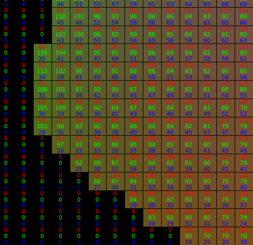

# CHOC-dataset-toolkit
Toolkit for the CORSMAL Hand-Occluded Containers (CHOC) dataset with codes to inspect the 3D data, clean the NOCS images, convert 6D object poses, instructions, and other utility functions. You can download the CHOC dataset [here](https://zenodo.org/record/5085801#.Y3zGQ9LP2V4), and read the corresponding paper [here](https://arxiv.org/abs/2211.10470).

[Webpage](https://corsmal.eecs.qmul.ac.uk/pose.html)

### Install requirements

- SciPy
- Open3D
- NumPy
- OpenCV

This code has been tested with python 3.9, but should work with other versions. You can make and activate a conda environment:
```
conda create -n CHOC-toolkit-env python=3.9
conda activate CHOC-toolkit-env
```

You can install the dependencies as follows:
```
pip install -r requirements.txt
```

### Running the sample codes

Here, we will explain how to inspect the data in 3D, clean the NOCS backgrounds, and convert the annotated poses into camera2object poses.
We will use "000251" in the CHOC mixed-reality data as example, which you can also find in this repository in the _sample_ folder.

  RGB                       |  NOCS                     |  Mask                     |  Depth
:--------------------------:|:-------------------------:|:-------------------------:|:-------------------------:
 |||

#### Inspecting the data

We provide some sample code to visualise the data in 3D.
```
python inspect_data.py --choc_dir <path_to_choc>
```

#### Clean the NOCS backgrounds
```
python fix_nocs.py --choc_dir <path_to_choc>
```

Here is an example of the NOCS image ("000001.png") before and after using Otsu's algorithm to 'fix' the background:
  Before                    |  After
:--------------------------:|:-------------------------:
 |

#### Convert the poses

Here's an example of the annotated file, e.g.: CHOC > mixed-reality > annotations > b_000001_0010000 > 000001.json:
```
{
    "background_id": "000000.png",
    "flip_box": false,
    "grasp_id": 0,
    "location_xyz": [
        0.32728955149650574,
        4.607999801635742,
        -0.06526760011911392
    ],
    "object_id": 29,
    "pose_quaternion_wxyz": [
        0.9287700653076172,
        -0.1474159061908722,
        0.09974487870931625,
        0.3251240849494934
    ],
    "occlusion_ratio": 57.89473684210527
}
```
The _location\_xyz_ and _pose\_quaternion\_wxyz_ is the pose that was used to place the object inside the blender environment. It is NOT the camera-object pose. To convert the pose, you can do as follows:
```
python convert_poses.py --choc_dir <path_to_choc> --image_index <image_index_string>
```

For image_index "000001" the result will be:
```
Pose for blender:
[[   0.76869058   -0.633339      0.08942319  327.2895515 ]
 [   0.57452307    0.74512576    0.33868989 4607.99980164]
 [  -0.28113704   -0.20897204    0.93663902  -65.26760012]
 [   0.            0.            0.            1.        ]]

Pose between camera and object:
[[    0.76869058    -0.633339       0.08942319   332.58864591]
 [   -0.28113704    -0.20897204     0.93663902    -9.76367027]
 [   -0.57452307    -0.74512576    -0.33868989 -4628.07009489]
 [    0.             0.             0.             1.        ]]
```
Pose for blender is simply _location\_xyz_ and _pose\_quaternion\_wxyz_ converted into a 4x4 transformation matrix.
Pose between camera and object is the 4x4 transformation matrix between the camera and object.

### Other instructions

<details>
<summary> Instructions to load the GraspIt! world files</summary>

<br>
  
#### 
1. Install ROS Melodic (or another version)
 * Follow: http://wiki.ros.org/melodic/Installation/Ubuntu

2. Install GraspIt!
 * First follow: https://graspit-simulator.github.io/build/html/installation_linux.html
 * Then follow: https://github.com/graspit-simulator/graspit_interface

3. Install ManoGrasp
 * Follow the steps ‘Install’ and ‘Model’ in https://github.com/ikalevatykh/mano_grasp

4. Open GraspIt! via terminal
```
$ source <your_graspit_ros_workspace>/devel/setup.bash
$ roslaunch graspit_interface graspit_interface.launch
```

5. Convert object files from .glb to .off
 * Convert .glb files to .off. Here's a Python code sample:

```python
import open3d as o3d

# Load .glb file
mesh = o3d.io.read_triangle_mesh(<path_to_input_glb_file>)

# Save as .off file
o3d.io.write_triangle_mesh(<path_to_output_off_file>, mesh)
```

 * Put all object .off files inside your GraspIt! workspace > objects > object_models

6. Load our GraspIt! world to load the hand and object
 * File > Import World > Look for the .xml files in graspit_worlds (e.g. right_hand_bottom_box_01.xml) 
</details>

### Enquiries

For any questions, please open an Issue on this repository, or send an email to corsmal-challenge@qmul.ac.uk.

### License

This work is licensed under the Creative Commons Attribution 4.0 International License. To view a copy of this license, visit http://creativecommons.org/licenses/by/4.0/ or send a letter to Creative Commons, PO Box 1866, Mountain View, CA 94042, USA.